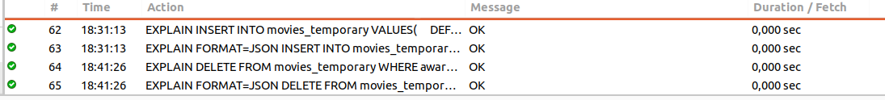

#### SQL 3 Movies

1. Explicar el concepto de normalización y para que se utiliza.

```
La normalización es un proceso de estandarización y validación de datos que consiste en eliminar las redundancias o inconsistencias, completando datos mediante una serie de reglas que actualizan la información, protegiendo su integridad y favoreciendo la interpretación, para que así sea más simple de consultar y más eficiente para quien la gestiona.
```

2. Agregar una película a la tabla movies.
```sql
INSERT INTO movies VALUES(DEFAULT, NOW(), NOW(), "NUEVA PELI", 7.9, 3, NOW(), 120, 2) 
```

3. Agregar un género a la tabla genres.
```sql
INSERT INTO genres VALUES(DEFAULT, NOW(), NOW(), "NUEVO GENERO", 23, 1)
```
4- Asociar a la película del Ej 2. con el género creado en el Ej. 3.
```sql 
UPDATE movies SET genre_id = 13 WHERE id = 22; -- genre_id es el id del nuevo genero agregado y id 22 es la última pelicula creada
```

5. Modificar la tabla actors para que al menos un actor tenga como favorita la película agregada en el Ej.2.
```sql
UPDATE actors SET favorite_movie_id = 22 WHERE id=2;
SELECT a.first_name, a.last_name, m.title FROM actors AS a -- Comprobanción
	INNER JOIN movies AS m ON a.favorite_movie_id = m.id 
    WHERE a.favorite_movie_id = 22;
```

6. Crear una tabla temporal copia de la tabla movies.
```sql
CREATE TEMPORARY TABLE movies_temporary AS SELECT * FROM movies; -- Tambien es posible crear la tabla temporal con el mismo nombre 

-- or 
CREATE TEMPORARY TABLE IF NOT EXISTS movies_temporary(
	id int not null primary key auto_increment,
    created_at timestamp not null,
    updated_at timestamp not null,
    title varchar(255) not null, 
    rating decimal(3,1) not null, 
    awards int not null,
    release_date datetime not null, 
    length int not null,
    genre_id int not null
);

INSERT INTO movies_temporary VALUES(
	DEFAULT,
    current_timestamp(),
    current_timestamp(),
    "titulo",
    5.9,
    4,
    NOW(),
    4,
    2
)
```
7. Eliminar de esa tabla temporal todas las películas que hayan ganado menos de 5 awards.

```sql
SET SQL_SAFE_UPDATES = 0; -- Para desactivar el modo seguro de actualización en caso de que obtenga algun error
DELETE FROM movies_temporary WHERE awards < 5;
```

8. Obtener la lista de todos los géneros que tengan al menos una película.
```sql 
SELECT g.name FROM genres AS g LEFT JOIN movies AS m ON m.genre_id = g.id
	GROUP BY g.name
    HAVING COUNT(m.id) >= 1;
```

9. Obtener la lista de actores cuya película favorita haya ganado más de 3 awards. 
```sql
SELECT a.* FROM actors AS a INNER JOIN movies AS m 
	ON m.id = a.favorite_movie_id
    WHERE m.awards > 3;
```
10. Utilizar el explain plan para analizar las consultas del Ej.6 y 7.


```sql 
EXPLAIN INSERT INTO movies_temporary VALUES(
	DEFAULT,
    current_timestamp(),
    current_timestamp(),
    "titulo",
    5.9,
    4,
    NOW(),
    4,
    2
)

EXPLAIN DELETE FROM movies_temporary WHERE awards < 5; -- Tambien es posible usar EXPLAIN ANALIZE
```
11. ¿Qué son los índices? ¿Para qué sirven?
```
Un índice contiene claves generadas a partir de una o varias columnas de la tabla o la vista. Dichas claves están almacenadas en una estructura (árbol b) que permite que el motor de base de datos SQL busque de forma rápida y eficiente la fila o filas asociadas a los valores de cada clave.
```
12. Crear un índice sobre el nombre en la tabla movies.
```sql
CREATE INDEX title_idx ON movies_temporary (title);
CREATE INDEX title_idx ON movies (title);
```
13. Chequee que el índice fue creado correctamente.
```sql
SHOW INDEX FROM movies_temporary;
SHOW INDEX FROM movies;
```
